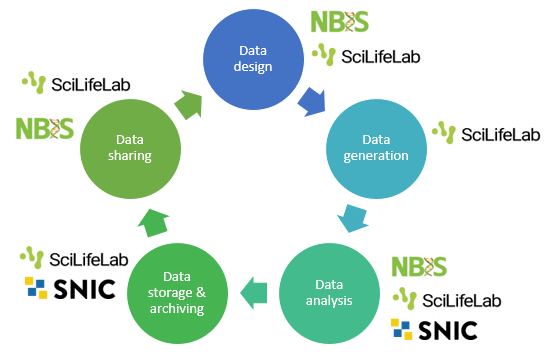

********
COVID-19
********
General information
###################
Please see the `Swedish COVID-19 Data Portal <https://www.covid19dataportal.se/>`_ 
for the latest information regarding Swedish efforts in COVID-19 research, including 
data generating facilities. 
Also see the `European COVID-19 Data Portal <https://www.covid19dataportal.org/>`_ 
and `Horizon 2020 guidelines regarding COVID-19 <https://ec.europa.eu/research/participants/data/ref/h2020/other/hi/oa-pilot/h2020-guidelines-oa-covid-19_en.pdf>`_ 
for useful information on European level.

Data Life Cycle
###############
The data life cycle is typically divided into design, generation, analysis, 
storage & archiving, and sharing. Below you will find information about standards and 
infrastructure resources available during these phases.

Data design
****************************
During this phase you plan for wich data is needed to answer your research 
question. High quality science is often only possible if the resource 
facilities you intend to use gets involved already in the planning phase 
of a project. Consultation and advice regarding data management planning, 
data generation and data analysis are offered by `NBIS <https://nbis.se>`_ 
and `SciLifeLab <https://scilifelab.se>`_.

It is wise to write a data management plan, using either a tool provided by your 
university or `DS wizard <http://dsw.scilifelab.se/>`_.

Also, some resources have specific application periods and thus needs to be 
contacted well in advance. If your project includes sensitive human data, note 
that there are ethical and legal issues that you have to consider, such as 
apply for an ethics approval and report the data processing to your 
`Data Protection Officer </general/data_protection_officer>`_. See the page on 
:ref:`Sensitive data </general/sensitive_data>` for more information.

Data generation
****************************
SciLifeLab `National Genomics Infrastructure <https://ngisweden.scilifelab.se/>`_ (NGI) 
provide a wide range of sequencing technologies and can offer state-of-the-art solutions 
for many different types of COVID-19 sequencing projects. 
`Chemical proteomics & proteogenomics <https://www.scilifelab.se/facilities/chemical-proteomics-proteogenomics/>`_ 
and `BioMS <https://bioms.se/>`_ offers mass spectrometry support.
For a complete list please visit `Swedish COVID-19 Data Portal <https://www.covid19dataportal.se/>`_.

Data analysis
****************************
* `NBIS <https://nbis.se/support/>`_ (National Bioinformatics 
  Infrastructure Sweden) is a national research infrastructure that offers 
  bioinformatic support in various forms for a wide range of areas including 
  NGS, proteomics, metabolomics and biostatistics.

* `SNIC <https://www.snic.se/>`_ (Swedish National Infrastructure for Computing) 
  is a national research infrastructure that makes available 
  large scale high performance computing resources. 
  `Apply <https://www.snic.se/allocations/compute/>`_ 
  for Small, Medium, Large or Sensitive data allocation, depending on 
  size and type of project.

Data storage and archiving
****************************
After the project is finished, the data needs to be stored in a backed-up 
fashion at least for 10 years, and for as long as the data is of scientific 
value. After this time, some of the data should be archived and some can be 
disposed. It is best to contact your university 
:ref:`../general/research_data_office` for information about the procedures 
for this.  

`SNIC  <https://www.snic.se/allocations/storage/>`_ offers storage for small 
and medium-sized datasets. In the future also large-sized storage will be offered.

Data sharing
****************************
The guidelines in all sections regarding COVID-19 has been adapted from the 
`Research Data Alliance <https://rd-alliance.org/>`_ 5th release of the 
`COVID-19 Data Sharing Recommendations & Guidelines <https://www.rd-alliance.org/system/files/RDA%20COVID-19%3B%20recommendations%20and%20guidelines%2C%205th%20release%20%28final%20draft%29%2028%20May%202020.pdf>`_

**In general:**

* Think early about systematic naming of filenames. Not thinking about it early enough is 
  often the cause of a lot of extra work when the data is not stored in a database and 
  researchers have to rename a large number of files manually at a later stage.
* Document the computing time and resources required for data processing. This could 
  help other researchers to assess the time and resources required for the pipeline, 
  therefore to decide whether it is feasible to proceed with the local resources available.
* When selecting a repository for submission of the data, priority should be given 
  to domain-specific repositories over generic (e.g. institutional) repositories. 
  Domain-specific repositories are easier to find, and often have better visualization 
  and selection facilities for re-users of the data.
* The repositories listed for deposition are also prime locations for locating existing 
  data. Many now have dedicated sections for new as well as pre-existing data relevant to 
  Covid19 research. 

The following sections contain guidelines adressing specific covid-19 data 
types and resources:

.. toctree::
  :maxdepth: 1

  virus-genomics
  host-genomics
  structural-data
  proteomics
  metabolomics
  lipidomics

